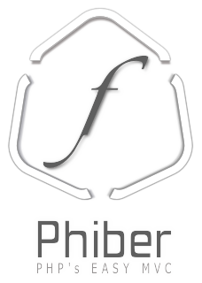

 

Phiber Framework (PHP's EASY MVC)
===

Phiber Framework is the lightest full stack PHP MVC framework. Phiber ships with basic components providing a bare minimum of boiler plates and allow for extension and library integration to add functionality as needed. Main components include MVC layout, Modules, Plugins, ORM, Cache, Session, Events, Log and Error handling.

Phiber framework applications are moduler with an easy drop-in architecture. A sample application is available on packagist as a template. Phiber also provides a command line tool called Myo to help create and maintain different parts of your application.  

Features
===
- Very easy to learn (probably why you picked PHP in the first place)
- Very easy to develope and deploy with [Myo](https://github.com/ghousseyn/phiber-myo) and [Composer](https://getcomposer.org)
- Lightweight and very fast (100k uncompressed)
- One-file easy configuration
- Painless Routing (simple and RegEx/named params)
- Drop-in architecture for plugins, modules and even controllers
- True MVC (Models CAN communicate with views directly)
- Eventful (trigger and listen to events if you want to)
- OOSQL ORM and Query builder (Zero configuration)
- Entity generator (Design your DB like a DBA)
- Use any library out there within your plugins, models or controllers
- Myo command line tool to speed up development and prototyping

Documentation
===

Check [Phiber Framework Documentation](http://ghousseyn.github.io/phiber)

Newsletter
==
[Phiber Framework Group](https://groups.google.com/forum/#!forum/phiber)
